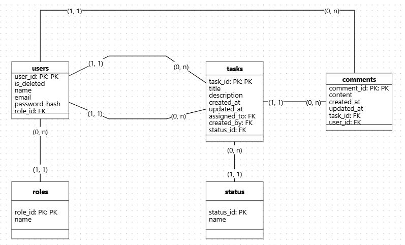

# Projeto de Engenharia de Software: Arquitetura e Padrões

## Objetivo

Desenvolver uma API para um sistema de Gestão de Tarefas Colaborativas, permitindo que usuários criem, editem, atribuam e concluam tarefas. A API seguirá uma arquitetura MVC, garantindo boas práticas.

## Pre-requisitos

- [node](https://nodejs.org/en/download)
- [npm](https://docs.npmjs.com/downloading-and-installing-node-js-and-npm)

### Instalação alternativa

Instalar o [nvm](https://github.com/nvm-sh/nvm)

``` sh
curl -o- https://raw.githubusercontent.com/nvm-sh/nvm/v0.40.3/install.sh | bash
```

Instalar o node e o npm através do nvm:

``` sh
nvm install node
```

## Inicializando

Clonar o repositório

``` sh
git clone <github url>
```

Instalar dependencias

``` sh
cd <project_name>
npm install
```

Build and run

``` sh
npm start
```

## Arquitetura: MVC

``` md
project-root/
│
├── collection/                  # Requests para a API feita com o Bruno
│
├── docs/                        # Arquivos utilizados na documentação, como imagens
│
├── src/
│   ├── configs/                 # Configurações para roda de autenticação
│   │   ├── auth.config.ts
│
│   ├── controllers/             # Lógica dos endpoints HTTP
│   │   ├── auth.controller.ts
│   │   ├── task.controller.ts
│   │   └── user.controller.ts
│
│   ├── routes/                  # Registro das rotas no Fastify
│   │   ├── auth.routes.ts
│   │   ├── task.routes.ts
│   │   └── user.routes.ts
│
│   ├── schemas/                 # Validação e tipagem com Zod
│   │   └── auth.schema.ts
│   │   ├── task.schema.ts
│   │   ├── user.schema.ts
│
│   ├── models/                  # Mapeamento de dados (ORM ou SQL)
│   │   ├── task.model.ts
│   │   ├── user.model.ts
│   │   └── comment.model.ts
│
│   ├── services/                # Regras de negócio (camada intermediária)
│   │   ├── task.service.ts
│   │   ├── user.service.ts
│   │   ├── auth.service.ts
│   │   └── notification.service.ts   # Novo serviço para envio de notificações por e-mail
│
│   ├── notifications/           # Lógica de envio de e-mails (integração com SMTP, Mailgun, etc)
│   │   ├── emailClient.ts        # Configuração do transporte de e-mails (nodemailer, etc)
│   │   └── templates/            # Templates de e-mail (HTML/TXT)
│   │       ├── taskUpdated.html
│   │       └── welcomeUser.html
│
│   ├── db/                      # Conexão com o banco (PostgreSQL)
│   │   ├── client.ts
│   │   └── migrations/
│
│   ├── middlewares/             # Autenticação, erros, permissões
│   │   ├── auth.middleware.ts
│   │   └── error.middleware.ts
│
│   ├── plugins/                 # Plugins do Fastify (CORS, JWT, etc)
│   │   ├── auth.plugin.ts
│   │   ├── swagger.plugin.ts
│   │   └── zod.plugin.ts
│
│   ├── openapi/                 # Arquivos OpenAPI/Swagger
│   │   └── openapi.yaml
│
│   ├── utils/                   # Helpers, formatação, tokens, etc.
│   │   ├── jwt.ts
│   │   └── formatDate.ts
│
│   └── server.ts                # Inicia o servidor
│
├── tests/                       # Testes com Jest
│   ├── unit/
│   │   ├── task.service.test.ts
│   │   └── notification.service.test.ts
│   └── integration/
│       └── task.routes.test.ts
│
├── .env
├── tsconfig.json
├── jest.config.ts
├── package.json
└── README.md
```

## Estrutura do Banco de Dados



### users table

- user_id: string, required, uuid, unique
- name: string
- email: string, required, unique
- password_hash: string, required
- password_salt: string, required
- updated_at: timestamp, required
- created_at: timestamp, required

### tasks table

- task_id: string, required, uuid, unique
- title: string, required
- description: string
- created_at: timestamp, required
- updated_at: timestamp, required
- status: string, required
- created_by: string, uuid, required, FK from users_table
- assigned_to: string, uuid, required, FK from users_table

### comments table

- comment_id: string, required, uuid, unique
- content: string, required
- created_at: timestamp, required
- updated_at: timestamp, required
- task_id: string, uuid, required, FK from tasks_table
- user_id: string, uuid, required, FK from users_table

## Stack do Projeto

### 🟩 Node.js

Plataforma de execução JavaScript no servidor, escolhida por sua leveza, ecossistema maduro e excelente performance para APIs HTTP.

### 🟦 TypeScript

Superset do JavaScript que adiciona tipagem estática ao código, aumentando a segurança, legibilidade e produtividade durante o desenvolvimento.

### ⚡ Fastify

Framework web focado em performance e baixo consumo de recursos, ideal para criar APIs rápidas, com suporte nativo a schemas, plugins e integração com Swagger.

### 🧪 Zod

Biblioteca de validação de dados com foco em **tipagem integrada ao TypeScript**, usada para validar entradas da API (body, params, query) e gerar schemas reutilizáveis.

### 📚 Swagger

Ferramenta de documentação automática da API, permitindo que os endpoints sejam visualizados e testados via navegador com base nos schemas definidos em Zod.

### 🐘 PostgreSQL

Banco de dados relacional robusto, usado para persistir dados de forma segura, escalável e confiável. Ideal para sistemas com múltiplas entidades e relacionamentos.

### ✅ Jest

Framework de testes em JavaScript/TypeScript, utilizado para escrever e executar testes automatizados garantindo o funcionamento correto das funcionalidades da API.

### 🔒 Bcrypt

Biblioteca para hashing de senhas, utilizada para garantir a segurança das credenciais dos usuários, protegendo-as contra acessos não autorizados.

## Construção da API - Endpoints

### users

- GET       http://{{host}}/api/v1/users
- GET       http://{{host}}/api/v1/users{user_id}
- POST      http://{{host}}/api/v1/users
- PATCH     http://{{host}}/api/v1/users{user_id}
- DELETE    http://{{host}}/api/v1/users{user_id}

### tasks / comments

- GET       http://{{host}}/api/v1/tasks
- GET       http://{{host}}/api/v1/tasks{task_id}
- GET       http://{{host}}/api/v1/tasks{task_id}/comments
- GET       http://{{host}}/api/v1/tasks{task_id}/comments/{comment_id}
- POST      http://{{host}}/api/v1/tasks
- POST      http://{{host}}/api/v1/tasks{task_id}/comments
- PATCH     http://{{host}}/api/v1/tasks{task_id}
- PATCH     http://{{host}}/api/v1/tasks{task_id}/comments/{comment_id}
- DELETE    http://{{host}}/api/v1/tasks{task_id}
- DELETE    http://{{host}}/api/v1/tasks{task_id}/comments/{comment_id}

### auth

- POST      http://{{host}}/api/v1/auth/login
- POST      http://{{host}}/api/v1/auth/logout

## User's Happy Paths

1. Criar uma conta
2. Fazer login
3. Criar uma tarefa com o nome "Entregar trabalho da faculadade"
4. Verificar a lista de tarefas
5. Adicionar um comentário na tarefa criada que diz "Focar na parte teórica"
6. Atualizar o status da tarefa para "in progress"
7. Adicionar outro comentário na tarefa dizendo "Focar na parte prática"
8. Atualizar o status da tarefa para "done"
9. Fazer logout do sistema

## Tarefas para fazer

Emanu:

- [ ] Implementar o banco de dados com PostgreSQL (quem sabe através de migrations) -> Emanuzita
- [ ] Implementar API CRUD para comentários de taferas -> Emanuzita
- [ ] Implementar testes unitários - Emanuzita

Gabriela:

- [X] Implementar API CRUD para usuários -> Gabrela
- [X] Implementar API CRUD para tarefas -> Gabrela
- [ ] Implementar testes de integração - Gabrela

Bia:

- [X] Implementar API para autenticação -> Bia
- [X] Definir happy paths -> Bia
- [ ] Implementar notificação através de emails
