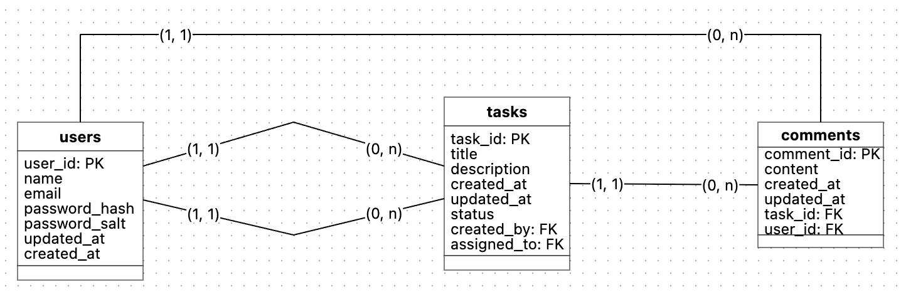

# Projeto de Engenharia de Software: Arquitetura e Padrões

## Objetivo

Desenvolver uma API para um sistema de Gestão de Tarefas Colaborativas, permitindo que usuários criem, editem, atribuam e concluam tarefas. A API seguirá uma arquitetura MVC, garantindo boas práticas.

## Pre-requisitos

### Alternativa 1

- [node](https://nodejs.org/en/download)
- [npm](https://docs.npmjs.com/downloading-and-installing-node-js-and-npm)

### Alternativa 2

Instalar o [nvm](https://github.com/nvm-sh/nvm)

``` sh
curl -o- https://raw.githubusercontent.com/nvm-sh/nvm/v0.40.3/install.sh | bash
```

Instalar o node e o npm através do nvm:

``` sh
nvm install node
```

## Inicializando

Clonar o repositório

``` sh
git clone <github url>
```

Instalar dependencias

``` sh
cd <project_name>
npm install
```

Build and run

``` sh
npm run build
```

``` sh
npm run start
```

## Arquitetura: MVC

``` md
project-root/
│
├── collection/                         # Requests para a API feita com o Bruno
│
├── docs/                               # Arquivos utilizados na documentação, como imagens
│
├── src/
│   ├── controllers/                    # Lógica dos endpoints HTTP
│   │   ├── auth.controller.ts
│   │   ├── task.controller.ts
│   │   └── user.controller.ts
│
│   ├── routes/                         # Registro das rotas no Fastify
│   │   ├── auth.routes.ts
│   │   ├── task.routes.ts
│   │   └── user.routes.ts
│
│   ├── schemas/                        # Validação e tipagem com Zod
│   │   └── auth.schema.ts
│   │   ├── task.schema.ts
│   │   ├── user.schema.ts
│
│   ├── models/                         # Mapeamento de dados (ORM ou SQL)
│   │   ├── task.model.ts
│   │   ├── user.model.ts
│   │   └── comment.model.ts
│
│   ├── db/                             # Conexão com o banco (PostgreSQL)
│   │   ├── client.ts
│   │   └── migrations/
│
│   ├── middlewares/                    # Autenticação, erros, permissões
│   │   ├── auth.middleware.ts
│   │   └── error.middleware.ts
│
│   ├── plugins/                        # Plugins do Fastify (CORS, JWT, etc)
│   │   ├── templates
│   │   │   └── notification.templates.json
│
│   ├── utils/                          # Helpers, formatação, tokens, etc.
│   │   └── types.utils.ts
│
│   └── database.ts                     # Configurações do database
│
│   └── server.ts                       # Inicia o servidor
│
├── tests/                              # Testes com Jest
│   ├── unit/
│   │   ├── task.service.test.ts
│   │   └── notification.service.test.ts
│   ├── integration/
│   │   └── task.routes.test.ts
│
├── .env
├── .env.example
├── .eslintrc.json
├── .gitignore
├── knexfile.ts
├── package-lock.json
├── package.json
├── README.md
├── tsconfig.json
└── vitest.config.ts
```

## Estrutura do Banco de Dados



## Stack do Projeto

### 🟩 Node.js

Plataforma de execução JavaScript no servidor, escolhida por sua leveza, ecossistema maduro e excelente performance para APIs HTTP.

### 🟦 TypeScript

Superset do JavaScript que adiciona tipagem estática ao código, aumentando a segurança, legibilidade e produtividade durante o desenvolvimento.

### ⚡ Fastify

Framework web focado em performance e baixo consumo de recursos, ideal para criar APIs rápidas, com suporte nativo a schemas, plugins e integração com Swagger.

### 🧪 Zod

Biblioteca de validação de dados com foco em tipagem integrada ao TypeScript, usada para validar entradas da API (body, params, query) e gerar schemas reutilizáveis.

### 📚 Swagger

Ferramenta de documentação automática da API, permitindo que os endpoints sejam visualizados e testados via navegador com base nos schemas definidos em Zod.

### 🗄️ SQLite 3

Banco de dados relacional leve e embutido, ideal para aplicações de pequeno a médio porte. Utilizado por sua simplicidade, portabilidade e zero configuração, permitindo armazenamento local eficiente e confiável.

### 🧪 Vitest

Framework de testes rápido e moderno, inspirado no Jest, com suporte nativo a TypeScript e integração perfeita com bibliotecas como Vite. Ideal para escrever e executar testes unitários e de integração

### 🔒 Bcrypt

Biblioteca para hashing de senhas, utilizada para garantir a segurança das credenciais dos usuários, protegendo-as contra acessos não autorizados.

## User's Happy Paths

1. Criar uma conta
2. Fazer login
3. Criar uma tarefa com o nome "Entregar trabalho da faculadade"
4. Verificar a lista de tarefas
5. Adicionar um comentário na tarefa criada que diz "Focar na parte teórica"
6. Atualizar o status da tarefa para "in progress"
7. Adicionar outro comentário na tarefa dizendo "Focar na parte prática"
8. Atualizar o status da tarefa para "done"
9. Fazer logout do sistema
